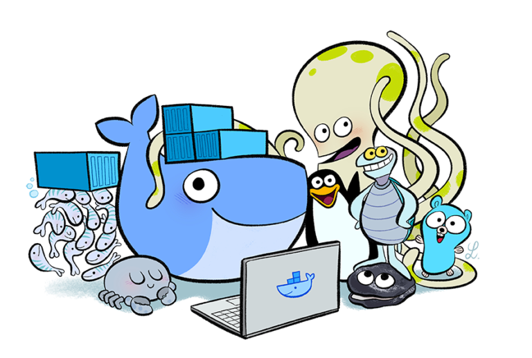

# Docker for dummies
Welcome to Docker for Dummies. This tutorial will help you understand what containers are, and how it fits in your development environment.

For a course outline, please have a look at the [course introduction](/docs/Welcome.md) but before we start, you'll have to [setting up your machine](setup.md).

_If you find any issues in this tutorial, feel free to create an issue or a PR containing a fix._

[[_TOC_]]

## Repository Structure

This repo has a fairly basic structure:

- **docs** are used to publish the training as a wiki
- **labs** are exercises used in the training to be ran locally
