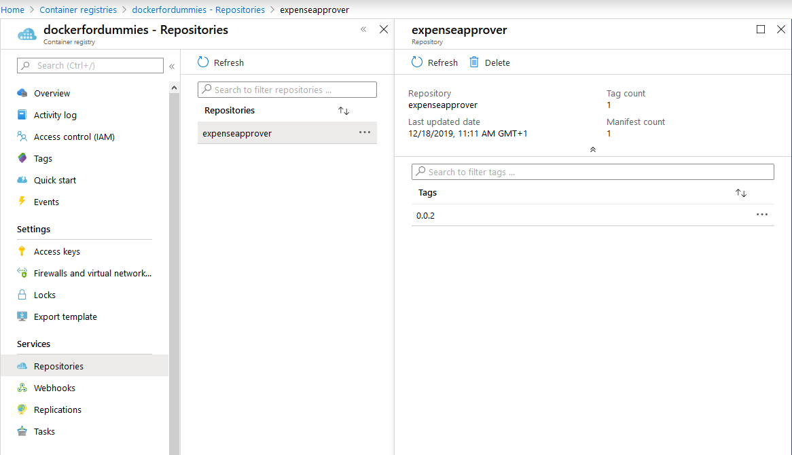

[[_TOC_]]

# Expense Approver - Deploying our container in Azure
In [2. Optimizing our container](/2.-Optimizing-our-container) we have created our first production-ready container, but how do we get it on other machines? Do we manually copy the container over to the server?

While that is certainly possible via [docker save](https://docs.docker.com/engine/reference/commandline/save/), it's almost never done this way. A better solution is to host your image on a registry, such as:
- [Docker Hub](https://hub.docker.com/): the default choice for open-source projects. Most base images are stored here.
- [Azure Container Registry](https://azure.microsoft.com/en-us/services/container-registry/)

We will use Azure Container Registry in this tutorial to store our container images and run it on Azure Container Instances.

## Pushing our image to Azure Container Registry

First we need to create an Azure Container Registry in Azure, you can do that by:

- Using the **Azure Portal** by following this [guide](https://docs.microsoft.com/en-us/azure/container-registry/container-registry-get-started-portal) up to pushing an image to ACR.
- Using the **[Azure CLI](https://docs.microsoft.com/en-us/cli/azure/get-started-with-azure-cli?view=azure-cli-latest)**:

```shell
az acr create --name dockerfordummies --sku Basic --resource-group docker-for-dummies --location westeurope
```

Before we can push our ExpenseApprover image to the container registry, we need to **tag it with the ACR login server name**.

```shell
docker tag expenseapprover:0.0.2 dockerfordummies.azurecr.io/expenseapprover:0.0.2
```

For the rest of this lab we will use `dockerfordummies.azurecr.io` but you can replace `dockerfordummies` with the name of your container registry.

Next, we need to **authenticate with Azure Container Registry** by following this [guide](https://docs.microsoft.com/en-us/azure/container-registry/container-registry-authentication).

In this example, we will use `docker login` with the admin account:
```shell
$ docker login dockerfordummies.azurecr.io
Username: dockerfordummies
Password: ***
Login Succeeded
```

:warning: _In production scenarios you should disable the admin account and use Role-based Access instead._

Last but not least, we can **push our image to the container registry**:
```shell
$ docker push dockerfordummies.azurecr.io/expenseapprover:0.0.2
The push refers to repository [dockerfordummies.azurecr.io/expenseapprover]
79e70615eaa3: Pushed
52d5ea296228: Pushed
239bf536471e: Pushed
cad0d4e88a35: Pushed
831c5620387f: Pushed
0.0.2: digest: sha256:7827788abb508d146fb0191c86a601877ed635eac40f8da22c2403d309f2bf64 size: 1374
```

You will see it starts uploading all layers to ACR. When uploading has finished, you should be able to find your image in the Azure portal as well, ready to be consumed by anyone.



## Deploying to Azure Container Instances
To test the container, one might deploy it to Azure Container Instances, like this:


Once deployed, we can see the logs of our container. Sure enough, it just works.
```shell
[2018-07-06T13:42:12Z] [caas-c05635103d3e41c2a83d56d3504fe0f9-3764885988-4hgxq] Starting up expense approver...
[2018-07-06T13:42:12Z] [caas-c05635103d3e41c2a83d56d3504fe0f9-3764885988-4hgxq] Pulling expense from the queue... 
[2018-07-06T13:42:12Z] [caas-c05635103d3e41c2a83d56d3504fe0f9-3764885988-4hgxq] Approving expense Train, 5 EUR
[2018-07-06T13:42:15Z] [caas-c05635103d3e41c2a83d56d3504fe0f9-3764885988-4hgxq] Approved
```

In the next part, [4. Looking into Visual Studio tooling](/4.-Looking-into-Visual-Studio-tooling), we will look at the Visual Studio tooling, and how it works.