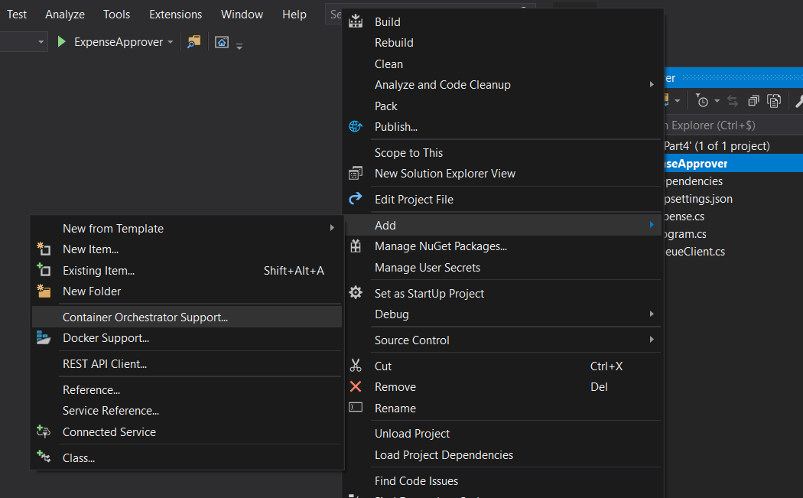

[[_TOC_]]

# Expense Approver - Understanding Visual Studio tooling
Now that we understand the basics of a `Dockerfile`, lets see what Visual Studio brings to the table.

The source code is identical to when we first started, just to see what Visual Studio does.

Open up `part4.sln` located in `labs/lab-4/src`, and add **Container Orchestrator Support**



This lets us choose between Windows and Linux, choose Linux for now since that's what we've been using in the other parts as well.

It adds the following files:
- `src/.dockerignore`
- `src/ExpenseApprover/Dockerfile`
- `src/docker-compose.dcproj`
- `src/docker-compose.override.yml`
- `src/docker-compose.yml`

## Dockerfile
Lets first inspect the file we already know, the `Dockerfile`:
```Dockerfile
FROM mcr.microsoft.com/dotnet/core/runtime:3.1-buster-slim AS base
WORKDIR /app

FROM mcr.microsoft.com/dotnet/core/sdk:3.1-buster AS build
WORKDIR /src
COPY ["ExpenseApprover/ExpenseApprover.csproj", "ExpenseApprover/"]
RUN dotnet restore "ExpenseApprover/ExpenseApprover.csproj"
COPY . .
WORKDIR "/src/ExpenseApprover"
RUN dotnet build "ExpenseApprover.csproj" -c Release -o /app/build

FROM build AS publish
RUN dotnet publish "ExpenseApprover.csproj" -c Release -o /app/publish

FROM base AS final
WORKDIR /app
COPY --from=publish /app/publish .
ENTRYPOINT ["dotnet", "ExpenseApprover.dll"]
```

We can see it's also using a multi-stage build. It's doing a restore, then a build, and then a publish, before creating the final image.

## .dockerignore
The `.dockerignore` file follows is similar to the `.gitignore` file we have in git. 

To know why it's useful, we need to understand what happens when we execute a `docker build` command. The docker CLI is essentially a client application that talks to the docker daemon (server). If we use _Docker for Windows_, the docker daemon is hosted inside a virtual machine. When we execute `docker build`, every file will be transferred to the daemon, regardless of what is in your `Dockerfile`. It's only after all files have been copied, that the daemon will look into your `Dockerfile` and see what needs to be done.

Using a `.dockerignore` file lets us optimize the time Docker spends transferring files to the Docker daemon.

## docker-compose
The other 3 files are all related to docker-compose. While not explicitly covered in this tutorial, docker-compose is mainly used when you're working with more than 1 container. Think about e.g. a webserver which needs to connect to a database.

Docker-compose makes this easy to do, by analyzing a `docker-compose.yml` file, it knows what containers to launch, with its respective configuration and settings. When running `docker-compose` it reads the `.yml` file, and launches the containers.

The docker tooling for visual studio relies on docker-compose to launch applications.

In the final part, [5. Moving our container to other environments](/5.-Moving-our-container-to-other-environments)., we will look at how we can build & release our Docker image to multiple environments with Azure DevOps.
