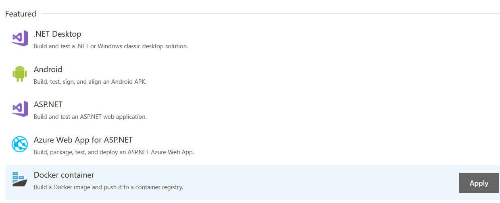

[[_TOC_]]

# Expense Approver - Moving your container to other environments
In previous chapters we've learned how to build, tag & push containers to a container registry and run them locally with Visual Studio; but how do we automatically deploy them across all our environments?

## How do we deploy our production-ready containers?

In traditional releases we publish one artifact after which we'll deploy, verify and promote it to every stage all the way up to production. For container workloads the artifact is the Docker container but there are a variety of ways to approach releases.

We highly recommend to build, tag and push Docker images to only one centralized container registry and deploy that artifact to all environments.

A **release build** will build, tag and push the new Docker image to our centralized container registry. The release build should also verify the container image by running integration tests, if that is possible. Once completed, we publish the as part of the build which can include other assets such as automation scripts, etc. which will trigger a new release pipeline to be started.

*:point_up: Release pipelines support a trigger for every new image version in Azure Container Registry which you can use as an alternative*

Every stage in the release pipeline will deploy the application on Microsoft Azure by referring to the container image and its tag. Azure will pull the image from the container registry with the service principle that was configured.

Here is a visual overview:

::: mermaid
graph LR
    DS[DEV]
    DEV[DEV API]
    TST[TST API]
    PROD[PROD API]
    TS[TST]
    PS[PROD]
    subgraph "Release Build"
    BuildImage[Build Image] --> Other((...));
    Other --> TagImage[Tag Image];
    TagImage --> PushImage[Push Image];
    PushImage --> PublishArtifacts[Publish Artifacts];
    end
    PushImage -->|Push Docker image| Registry
    subgraph "Artifact Repository"
    Registry(Production Container Registry)
    end
    PublishArtifacts-. Triggers Release Pipeline:1.0.-> DS
    subgraph "Release Pipeline"
    DS-->|Promote| TS;
    TS-->|Promote| PS;
    end
    subgraph "Azure ☁"
    DS-->|Deploy App to Azure |DEV;
    TS-->|Deploy App to Azure |TST;
    PS-->|Deploy App to Azure |PROD;
    DEV-. Pull Image :1.0.-> Registry;
    TST-. Pull Image :1.0.-> Registry;
    PROD-. Pull Image :1.0.-> Registry;
    end
:::

### Secure your container registry

As we are using one container registry for all our environments, it is crucial to provide according security controls.

We highly recommend to disable the admin account and use [role-based access](https://docs.microsoft.com/en-us/azure/container-registry/container-registry-roles) for all users:

- **Build & releases** should only have `Push image` permissions
- **Developers & operators** should only have `Pull image` permissions
- Only **Administrators** should be allowed to manage the registry and delete images.
    - This is because deleting a certain container image can cause an issues when your application is being scaled out. We recommend to rather "roll forward" and release a new version.

We encourage [assigning permissions that are scoped](https://docs.microsoft.com/en-us/azure/container-registry/container-registry-repository-scoped-permissions) to a [repository](https://docs.microsoft.com/en-us/azure/container-registry/container-registry-concepts), rather than on the whole registry since they can be re-used to host all container images for a company and not only for your project.

### Why we not one container registry per environment?

Another approach that is often used is to use a container registry per environment where images are being rebuilt on the same Git commit or images are being re-tagged.

We've found that this this approach is not ideal because:

- You no longer have 1 but *n* artifacts. Even if you're rebuilding on same commit or re-tagging, there is no guarantee that the outcome is the same so it's not 100% safe.
    - For example, somebody might have changed the build process of the image since previous stage or how it should be built is out of sync
- Your build & release flow becomes more complex as you have to rebuild/retag and push new images to other registries
- Your infrastructure becomes more complex as you have more container registries to manage
- Operations has to check differen container registries for other environments and verify different artifacts
- Flow is more error prone

## Building in Azure DevOps
So far we have built our solution on our local machine. This doesn't sound very secure, we have no idea what exactly is being built and put into each container. It would be much better if we could let a CI server handle this, and push it to ACR. Follow along on how to do this.

*Note*
If you don't have a Azure DevOps repository to test on, remember you can create your own for free to try things out.

First of all, make sure you push the source code to a Azure DevOps repository, this is beyond the scope of this tutorial. Once the code is ready, let's create a new build definition.

For our scenario, we can take the *Docker container* template:

It contains 2 tasks:
- Build an image
- Push an image

The configuration is likewise pretty simple. For our build task, we specify where the Dockerfile is, and the image name:

And then we configure our push task to push to Azure Container Registry:

If we now trigger the build, sure enough, an image will end up in Azure Container Registry, built from Azure DevOps. In a team-setting, we could now set up a continous integration build, which will automatically push the images to ACR. 
We can release any of those images at any time, and be sure it 'just works', thanks to container technology!

## Release in Azure DevOps
Having our image in ACR is the first step, we can then deploy that image to any service supporting containers. Kubernetes, Service Fabric, Azure Container Instances, etc...

A schematic overview of how your code gets from code to running on such a service is below:

After we have our image in Azure Container Registry, we can use the Release feature in Azure DevOps to actually trigger a release. A sample setup can be found on the _Builds_ and _Release_ pages of this project in Azure DevOps.

Since your build artifact is already published in the build stage, mostly you will only need to pass along the build tag to the release stage. This is because the release tasks using containers expect your image to be hosted somewhere, either on Docker Hub, Azure Container Registry, or somewhere else.

# The end
This concludes the tutorial on Docker For Dummies. Enjoy your future docker adventures.

